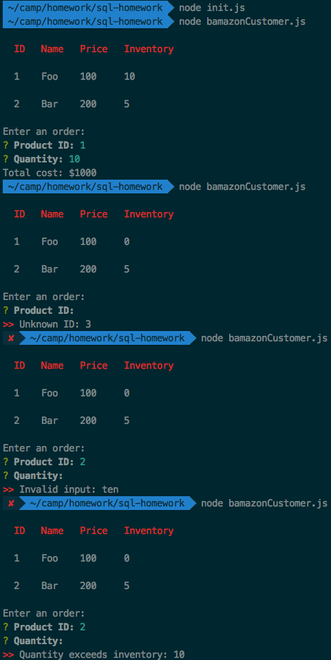

# sql-homework

I completed the first challenge and most of the second. The following screenshot demonstrates bamazonCustomer.js, with only two items in the DB for the sake of brevity. The first run shows the "happy path" and the others demonstrate the handling of various invalid inputs.

